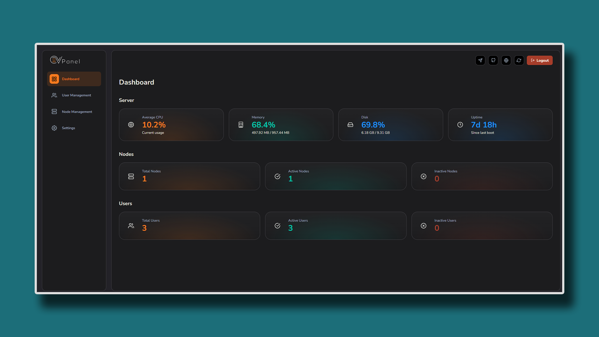

<div align="center">
  

  # **OV-Panel**
  Free, open-source and lightweight panel for managing **OpenVPN** servers and users.
</div>

  

---

## 🚀 Overview

**OV-Panel** is a modern and easy-to-use web panel that allows you to manage your **OpenVPN** server, users, and connections from a simple dashboard.

It’s designed for both beginners and system administrators who want a minimal yet powerful solution to handle OpenVPN deployments.

---

## ✨ Features

- 🧠 Simple and intuitive dashboard  
- ⚙️ User and connection management  
- 🔑 Auto user creation with configuration export  
- 🧩 Supports multiple OpenVPN servers (Node)  
- 🔒 JWT-based authentication  
- 🌐 API-ready for automation  

---

## ⚡ Quick Installation OV-Panel

You can install OV-Panel on a fresh Ubuntu/Debian system with a single command:

```bash
bash <(curl -s https://raw.githubusercontent.com/anonysec/ov/main/panel/install.sh)
```
## ⚡ Quick Installation OV-Node

You can install OV-Node on a fresh Ubuntu/Debian system with a single command:
```bash
bash <(curl -s https://raw.githubusercontent.com/anonysec/ov/main/node/install.sh)
```
